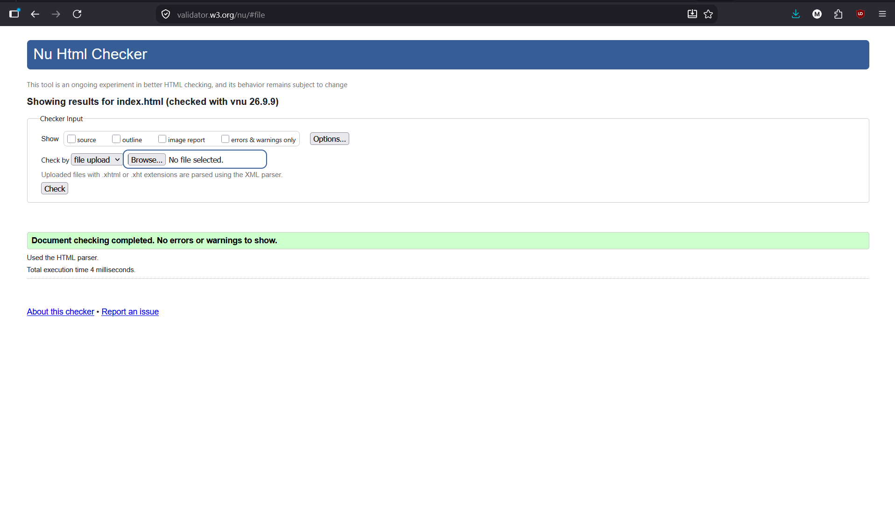
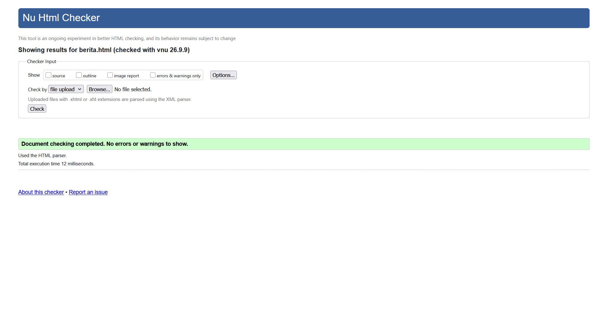

# Tugas 2 - Pengembangan Aplikasi Web (PAW)

## Data Mahasiswa
- **Nama**  : Muhammad Irfan Ramadhan
- **NIM**   : 124140159
- **Kelas** : RB

Repository ini berisi tugas pertemuan ke-2 mata kuliah Pengembangan Aplikasi Web (PAW) yang berfokus pada pembuatan halaman web statis bertema ITERA dengan memanfaatkan struktur semantik HTML:

1. **Halaman Utama (`index.html`)**
   - Menampilkan profil dan informasi data diri mahasiswa yang disusun menggunakan elemen heading, paragraf deskripsi, serta tabel terstruktur.
   - Memiliki navigasi utama dan catatan informasi tambahan.

2. **Halaman Berita (`berita.html`)**
   - Memuat konten artikel berita mengenai kegiatan dan pengabdian civitas akademika ITERA.
   - Menggunakan struktur semantik HTML5 seperti `<header>`, `<nav>`, `<main>`, `<section>`, `<article>`, `<figure>`, `<time>`, `<aside>`, dan `<footer>`.

## Screenshot Validasi W3C
Kedua halaman telah divalidasi menggunakan [W3C Nu Html Checker](https://validator.w3.org/nu/):

### 1. Validasi `index.html`

### 2. Validasi `berita.html`

