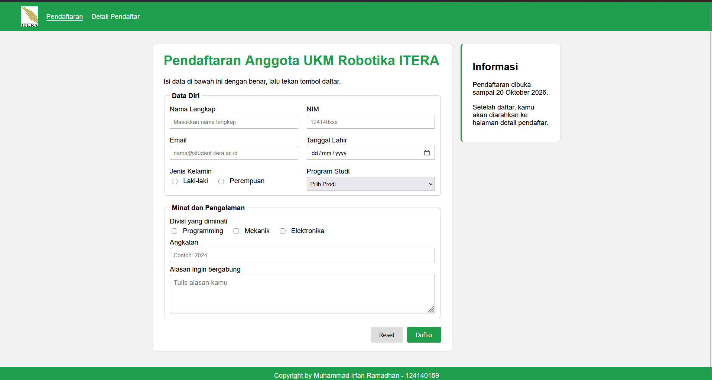
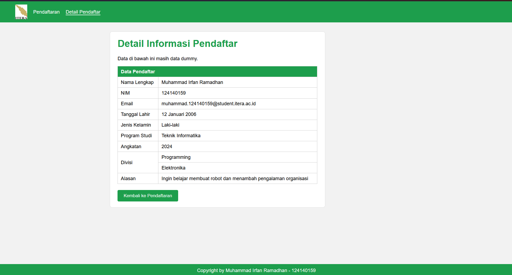

# Tugas 3 - Pengembangan Aplikasi Web (PAW)

## Data Mahasiswa
- **Nama**  : Muhammad Irfan Ramadhan
- **NIM**   : 124140159
- **Kelas** : RB

Hosting Github: https://irfanramadhan123.github.io/PAW_2026_Irfan/task_3/

Repository ini berisi tugas pertemuan ke-3 mata kuliah Pengembangan Aplikasi Web (PAW) yang berfokus pada pembuatan form HTML dan styling dengan CSS bertema pendaftaran UKM ITERA:

1. **Halaman Pendaftaran (`index.html`)**
   - Formulir pendaftaran anggota UKM Robotika ITERA dengan fieldset Data Diri (nama, NIM dengan validasi pattern 9 angka, email, tanggal lahir, radio jenis kelamin, select prodi dengan optgroup) serta Minat dan Pengalaman (checkbox divisi, datalist angkatan, textarea alasan).
   - Memiliki tombol reset/submit dan panel informasi samping (`aside`) berisi batas waktu pendaftaran.
   - Menggunakan struktur semantik HTML5 seperti `<header>`, `<nav>`, `<main>`, `<section>`, `<aside>`, dan `<footer>`.

2. **Halaman Detail Pendaftar (`detail.html`)**
   - Menampilkan data pendaftar dalam tabel (`<table>`, `<thead>`, `<tbody>`) dengan `colspan` pada header dan `rowspan` pada baris divisi.
   - Memiliki tombol kembali ke halaman pendaftaran.

Styling (`style.css`) menggunakan layout grid `.wadah` (3fr 1fr), card `.box`, navigasi hijau, serta media query responsif untuk layar kecil (max-width 700px).

## Screenshot Tampilan

### 1. Halaman Pendaftaran (`index.html`)

### 2. Halaman Detail Pendaftar (`detail.html`)

